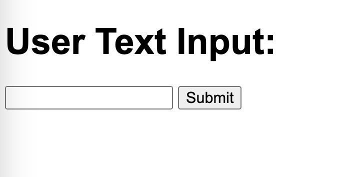

# Flask + OpenAI Chat Web App

This project is a simple Flask web application that implements a chat feature using the OpenAI API. Users can interact with the model and receive responses.

## How to Run the Application

1. **Install Dependencies:**  
   Before running the application, make sure you have Flask and the OpenAI Python SDK installed. You can install the dependencies using the following command:
   ```bash
   pip install flask openai
   ```

2. **Set Up OpenAI API Key:**  
   Before running the application, you need to set up the correct OpenAI API key. Add your API key to the code or set it as an environment variable.
   ```python
   import openai

   openai.api_key = 'YOUR_OPENAI_API_KEY'
   ```

3. **Run the Application:**  
   Use the following command to run the Flask application locally:
   ```bash
   python app.py
   ```
   The application will start at http://localhost:8080/.

## How to Use the Application

1. **Visit the Home Page:**  
   Open your browser and visit http://localhost:8080/. You will see an input box.

   

3. **Interact with the Model:**  
   Type text into the input box and press Submit button. You will see the model's response displayed on the page.

4. **View Output:**  
   The text you entered along with the model's response will be displayed on the page.

   

## Notes

- Make sure to keep your OpenAI API key confidential and do not store it in publicly accessible code repositories.

## License

This project is licensed under the [MIT License](LICENSE).
